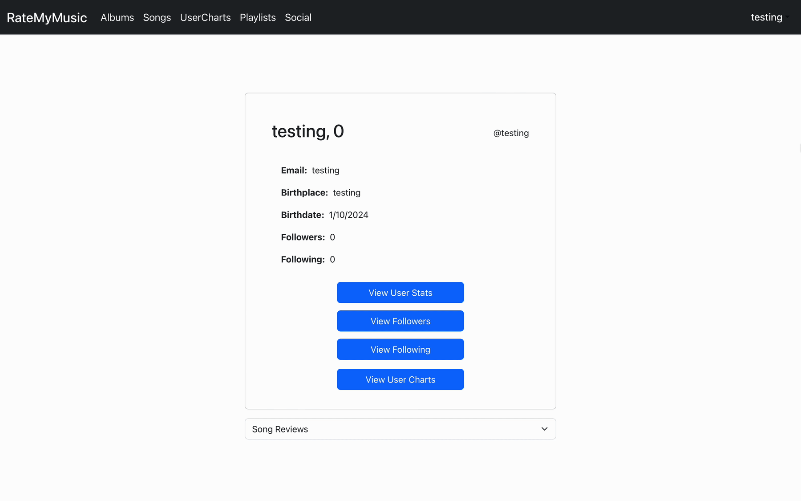
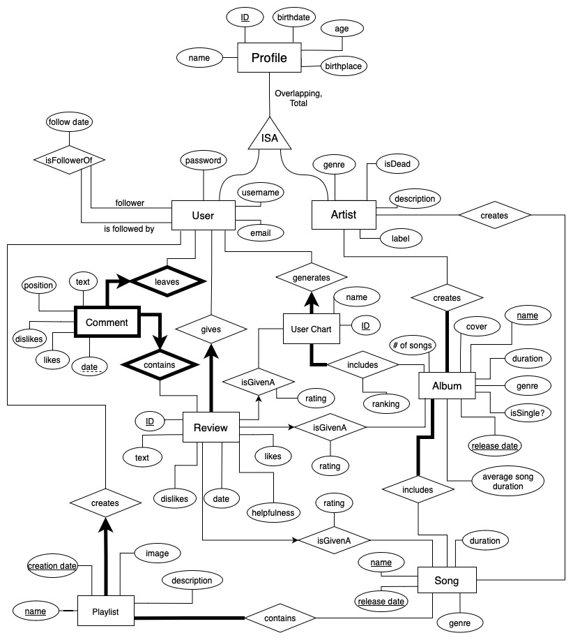
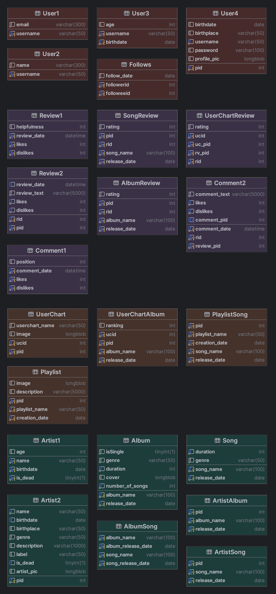

    <h1>
        RateMyMusic
    </h1>

    

        
        
  

    

## Contributors
- [Shrey Gangwar](https://github.com/shreygan)
- [Aftahi Ardi](https://github.com/aftahiArdi)
- [Greg Berezhnov](https://github.com/GregBerezhnov)

## Overview

 Albums 

    

 Songs 

    
    
Normal Filters

    
    
Advanced Filters

 Usercharts 

    

 Playlists 

    

 Users 

    

## Page Preview

 Clicking into an Album 

    

 Clicking into a Song 

    

 Clicking into a Userchart 

    

 Clicking into a Playlist 

    

 Clicking into a User 

    
    
Main Page

    
    
View User Stats

    
    
View Followers/Following

    
    
View User Charts

 Clicking into a User Review 

    

## User Functionality

 Creating an Account 

    

 Logging In 

    

 Updating Info 

    

 Creating Review 

    

 Creating Userchart 

    

 Creating Playlist 

    

 Leaving a Comment 

    

 Following/Unfollowing Users 

    

## Design

 ER Diagram 

    

 SQL Tables 

    

